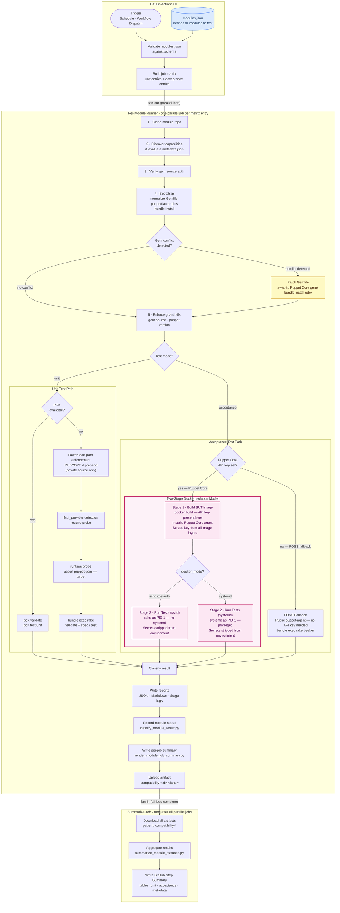

# Architecture Flow

This document describes how the Puppet Module Tester runs unit and acceptance
tests — from CI trigger through to result classification and reporting.

The runner is designed around a **per-module pipeline** that executes the same
sequence of stages for every module in the configured matrix, with a branching
point where unit and acceptance paths diverge.

---

## End-to-End Flow

---

## Stage-by-Stage Notes

### CI: Prepare

| Step | What happens |
|------|--------------|
| Trigger | Fires on a nightly schedule or manual `workflow_dispatch` (with optional profile and module override). |
| JavaScript action runtime | Workflow sets `FORCE_JAVASCRIPT_ACTIONS_TO_NODE24=true` so JavaScript-based actions run on Node 24 ahead of runner defaults. |
| Validate schema | `validate_modules_config.py` checks `config/modules.json` against the JSON schema before anything fans out. |
| Build matrix | `build_matrix.rb` expands the module list into two separate matrices: one for unit jobs and one for acceptance jobs (one row per module × target OS). |

### Per-Job Finalisation (end of every parallel job)

After the runner writes its outputs, each matrix job runs three additional steps before uploading its artifact:

| Step | Script | What it produces |
|------|--------|------------------|
| Record module status | `classify_module_result.py` | `module-status.json` — a compact status record (id, lane, class, compatibility state, metadata/dependency/documentation fields) written into the job's output directory. |
| Write per-job summary | `render_module_job_summary.py` | A per-module section appended to `GITHUB_STEP_SUMMARY`, visible on the individual job page in GitHub Actions. |
| Upload artifact | `actions/upload-artifact@v5` | Uploads the entire output directory as `compatibility-<id>-<lane>` so the summarize job can collect it. |

### CI: Summarize (fan-in)

The `summarize` job runs after **all** unit and acceptance jobs finish (with `if: always()` so it runs even when individual jobs fail). It:

1. Downloads every `compatibility-*` artifact into `all-artifacts/` via `actions/download-artifact@v5`.
2. Runs `summarize_module_statuses.py`, which walks the artifact tree collecting every `module-status.json`, sorts results by lane and module id, and writes a consolidated `GITHUB_STEP_SUMMARY` with:
   - A **Unit Compatibility** table (gating results).
   - An **Acceptance Compatibility** table (if any acceptance jobs ran).
   - Counters for clean / warning / failure across both lanes.
   - A metadata mismatch table for modules whose `metadata.json` does not declare support for the tested Puppet version.

### Shared Pipeline Stages (both test modes)

Each stage wraps a shell command via `StageRunner`. If a stage fails, the
pipeline **short-circuits** for that module — subsequent stages are skipped and
the result is classified immediately.

| Stage | Purpose |
|-------|---------|
| **Clone** | `git clone --depth 1` at the pinned ref. |
| **Discover capabilities** | Detects whether the module uses Vox-style rake vars (`uses_vox_vars`) and whether acceptance tests exist (`has_acceptance`). Also reads `metadata.json` to check declared Puppet version constraints. |
| **Verify auth** | Confirms that the required gem source (public or private Puppet Core) is reachable. An auth failure marks the result `inconclusive` immediately. |
| **Bootstrap** | Normalizes module `Gemfile` runtime pins (`puppet`/`facter`) to the target profile version in the workspace clone, then runs `bundle install` into a local vendor path. If a Puppet Core gem version conflict is detected, the runner attempts an automatic Gemfile patch and retries once. |
| **Guardrails** | Asserts that the installed `puppet` gem matches the expected exact version, and (if configured) that no OpenVox alternative gems were resolved. |

### Unit Test Path

The runner prefers PDK when it is available on the agent **and** the module
does not use custom Vox rake variables. Otherwise it falls back to Rake.

| Adapter | Commands |
|---------|----------|
| PDK | `pdk validate --puppet-version <N>`, then `pdk test unit --puppet-version <N>` |
| Rake | Inspects `rake -T` output, then runs `rake validate` and `rake spec` (or `rake test`) if those tasks exist. |

For rake-based unit runs the adapter inserts a deterministic `fact_provider` stage between `validate` and `unit`. This stage runs a single isolated `bundle exec ruby -e "require 'facter'; require 'puppet'; ..."` inside the module's resolved bundle and parses `Gemfile.lock`, then records:

- `fact_provider` — `facter`, `openfact`, or `unknown` (which gem actually wins `require 'facter'`)
- `fact_provider_gem` — gem name and version (e.g. `facter@4.17.0`)
- `puppet_provider` — `puppet`, `openvox`, or `unknown` (which gem actually wins `require 'puppet'`)
- `puppet_provider_gem` — gem name and version for the runtime-resolved provider (for example `puppet@8.17.0`)
- `puppet_lockfile_provider` — lockfile-only summary (`puppet@<v>`, `openvox@<v>`, or both if dual-resolved)
- `gemfile_facter` / `gemfile_openfact` — versions present in `Gemfile.lock` (or `absent`)
- `detection_method` — `bundle_resolution`, `gemfile_lock_inference`, or `unknown`
- `puppet_detection_method` — `bundle_resolution` or `unknown`
- `facter_runtime_version` — the `Facter::VERSION` constant value reported by the loaded gem
- `puppet_runtime_version` — the `Puppet.version` value reported by the loaded runtime provider
- `enforcement` — `skipped`, `attempted`, `succeeded`, or `failed` (see Facter Load-Path Enforcement below)

This approach does not depend on tests actually exercising the Facter API, does not depend on `RUBYOPT`/env-var inheritance across `system()`-spawned rspec children, and is not defeated by `rspec-puppet`'s `facter_implementation = 'rspec'` stub layer.

If `fact_provider` resolves to **OpenFact** — or only the OpenFact gem is present in `Gemfile.lock` — the runner records `dependency_status = warning` with an explicit compatibility message. This indicates the unit run was not a definitive Perforce Puppet Core + Perforce Facter compatibility signal.

#### Facter Load-Path Enforcement

When `gem_source_mode` is `private` (Puppet Core profiles) and the resolved bundle contains **both** the `facter` and `openfact` gems, the adapter performs a best-effort enforcement step before the `fact_provider` detection stage:

1. It locates the installed `facter` gem's `lib/` directory via `bundle show facter`.
2. It prepends that path to the `RUBYOPT` environment variable (e.g. `RUBYOPT="-I/path/to/facter-4.17.0/lib"`).
3. This causes `require 'facter'` to resolve to the Perforce Facter gem instead of OpenFact in all subsequent stages (`validate`, `fact_provider`, `unit`), including child processes spawned by `rake spec` via `system()`.

The enforcement is **best-effort and non-failing**: if the facter gem path cannot be located, the pipeline continues without modification and the existing OpenFact warning fires as usual. The `enforcement` field in the `fact_provider` summary records the outcome.

After `fact_provider`, the adapter runs `unit_runtime_probe` (`bundle exec ruby -e ...`) to assert the runtime-resolved `puppet` gem exactly matches `PUPPET_GEM_VERSION` immediately before unit execution. This ensures module-defined Gemfile constraints cannot silently change the tested Puppet Core version.

### Acceptance Test Path

Acceptance tests run against a real OS inside a Docker container managed by
[Beaker](https://github.com/voxpupuli/beaker). The target OS is defined by a
**setfile** — a YAML file under `config/beaker/setfiles/` that declares the
Docker image and platform string.

#### Docker Container Modes

Each acceptance target can specify a `docker_mode` in `modules.json` that
controls how the SUT container runs:

| Mode | PID 1 process | Use case | Tradeoffs |
|------|---------------|----------|-----------|
| `sshd` (default) | `/usr/sbin/sshd -D -e` | General modules that don't require systemd service management. Fast, portable, stable SSH. | Services managed by systemd (e.g. chronyd, firewalld) cannot start. |
| `systemd` | `/usr/sbin/init` | Modules whose acceptance tests assert service running/enabled state. Container runs privileged with cgroup mounts. | Heavier, requires privileged container, may be less stable across CI kernels. |

The `sshd` mode was chosen as the default because Beaker's built-in default
command (`service sshd start; tail -f /dev/null`) caused ECONNRESET loops in
non-systemd containers, and running sshd directly as PID 1 resolved that
instability.

#### Two-Stage Docker Isolation Model

When `PUPPET_CORE_API_KEY` is set, the runner uses a deliberate two-stage
design to ensure that the API key is **never exposed to untrusted module test
code**:

1. **Stage 1 — Build SUT Image** (`build_sut_image`): The runner invokes
   `docker build` with the key injected as a BuildKit secret. The Dockerfile
   installs the Puppet Core agent inside the image and then removes all
   credential-bearing repo config files in the **same layer**, so the key
   does not persist in the image history.

2. **Stage 2 — Run Tests** (`acceptance`): The runner writes a _clean_ setfile
   that references only the pre-built local image tag — no credentials
   anywhere. Before invoking Beaker, it strips `PUPPET_CORE_API_KEY`,
   `BUNDLE_RUBYGEMS___PUPPETCORE__PUPPET__COM`, `PASSWORD`, and `USERNAME`
   from the subprocess environment. Module test code runs with no access to
   any secret.

#### FOSS Fallback

When no API key is present, the runner sets `BEAKER_PUPPET_COLLECTION` to the
appropriate `puppet<N>` collection name and Beaker installs the public
`puppet-agent` package from `yum.puppet.com` (capped at 8.10.0, the last FOSS
release).

### Result Classification

After all stages complete, the `Classifier` assigns one of these states:

| State | Meaning |
|-------|---------|
| `compatible` | All stages passed; metadata declares support for the target Puppet version. |
| `conditionally_compatible` | Tests passed but one or more soft checks raised a warning (see overrides below). |
| `not_compatible` | One or more test stages failed with no applicable override. |
| `inconclusive` | Auth failure, missing acceptance stage, or empty stage list — result cannot be trusted either way. |
| `harness_error` | A bootstrap or infrastructure stage failed (clone, bundle, docker build, etc.) — the test never ran. |

#### Classification precedence (unit mode)

The classifier evaluates conditions in this order, stopping at the first match:

1. Auth status is not `ok` → **`harness_error`**
2. Any harness stage failed (`clone`, `bundle_config_*`, `bootstrap`, `bootstrap_dependency_patch`, `bootstrap_puppet_core_retry`, `build_sut_image`, `rake_tasks`, `pdk_version`) → **`harness_error`**
3. Any non-bootstrap stage failed → **`not_compatible`** _(subject to downgrade overrides — see below)_
4. Metadata reports the Puppet version as unsupported **and** `metadata_mode=fail` → **`not_compatible`**
5. Metadata reports unsupported version (warn mode) → **`conditionally_compatible`**
6. Dependency status is `warning` → **`conditionally_compatible`**
7. Documentation status is `warning` → **`conditionally_compatible`**
8. No stages ran → **`inconclusive`**
9. Otherwise → **`compatible`**

Dependency warnings can come from either Gemfile conflict recovery or OpenFact detection by the `fact_provider` stage.

For **acceptance mode** the logic is simpler: if the `acceptance` stage is absent the result is `inconclusive`; otherwise the stage exit code maps directly to `compatible` or `not_compatible`.

#### Downgrade overrides

Certain known-good failure patterns are recognised and reclassified before the classifier runs. The failing stage is patched to `passed` and a warning record is injected instead, so the final state becomes `conditionally_compatible` rather than `not_compatible`.

| Override | Trigger condition | Reclassified as |
|----------|-------------------|-----------------|
| **Puppet 8.12 `server` setting default change** | Unit stage fails; output contains both `"server"=>"puppet"` and `"server"=>""` and there is exactly one `::error` in the output. Caused by the Puppet Core 8.12 breaking change that changed the `server` setting default from `"puppet"` to `""`. | `dependency_status = warning` → stage patched to `passed` → final state `conditionally_compatible` |
| **Stale `REFERENCE.md`** | Validate stage fails; output contains `REFERENCE.md is outdated`. The module's reference documentation is out of date but this is not a runtime compatibility failure. | `documentation_status = warning` → stage patched to `passed` → final state `conditionally_compatible` |
| **Gemfile dependency conflict (recovery)** | Bootstrap fails with a Puppet Core gem version conflict. The runner patches the Gemfile to add Puppet Core-compatible constraints and retries `bundle install` once. If the retry succeeds, bootstrap is marked `passed` and `dependency_status = warning` is set. | `dependency_status = warning` → bootstrap patched to `passed` → final state `conditionally_compatible` |

### Reporting

`Reporting` writes three outputs per run into the configured output directory:

- `compatibility-report.json` — full structured result for every module.
- `compatibility-summary.md` — human-readable Markdown table.
- `artifacts/<module-id>/` — per-stage `.log` files copied from the workspace.
