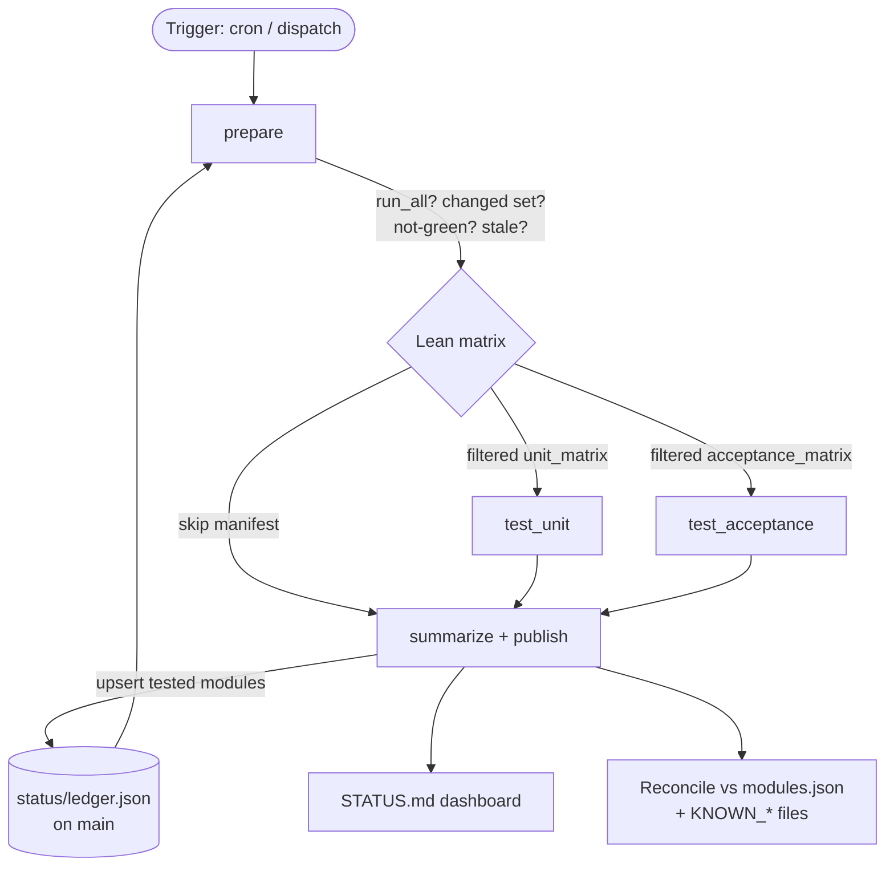

# Design: Lean Testing + Central Status Ledger

**Status:** Phases 1–3 implemented
**Author:** (harness maintainers)
**Date:** 2026-07-13

**Implementation status:**
- **Phase 1 (ledger + dashboard):** done — `update_ledger.py`, `render_status_dashboard.py`, `ledger_lib.py`, `status/ledger.json`, `STATUS.md`, publish job.
- **Phase 2 (lean matrix):** done — `detect_changes.py`, `build_matrix.rb` filtering, `lean` dispatch input, skip manifest + Skipped summary section.
- **Phase 3 (auto-generate `KNOWN_COMPATIBLE.md`):** done — generated by `render_status_dashboard.py` from the ledger via `is_fully_compatible` (blocked/pending excluded), committed by the publish job. Acceptance disposition (`running`/`blocked`/`pending`/`none`) is a per-module field in `modules.json` (schema-enforced), also feeding `STATUS.md` and the generated `docs/available-acceptance-tests.md` audit.

---

## 1. Motivation

Today the compatibility runner rebuilds the full test matrix on every run (nightly
cron + manual dispatch) and executes **all** modules regardless of whether anything
that could change their result has actually changed. With 68 modules (39 with
acceptance tests), this is slow and spends most of its runtime re-confirming
results that cannot have moved.

Only three things can turn a previously-green result red:

1. A change on the **target community module** repo.
2. A change in the **harness** repo (runner logic, profiles, CI, Docker).
3. A change in **Puppet Core** — which today is expressed *as* a harness change
   (we bump the version via config), so #2 and #3 are covered together.

**Goal A — Lean testing:** only run modules that could have changed, to cut
runtime and focus attention on what actually moved.

**Goal B — Central status:** once runs are lean, no single run reflects the full
fleet anymore. We need a durable, complete "dashboard" of current status for
**all** modules — the numbers reported weekly (how many covered by unit tests,
how many by acceptance tests, how many compatible) — independent of which modules
ran on any given day.

These two goals are coupled: lean testing *shrinks* what runs, and the ledger
*preserves* the full picture — and feeds back into deciding what the lean matrix
must force-run (stale entries, not-green entries).

### Non-goals

- **No Puppet Forge integration.** Forge compatibility is tracked separately today
  and is explicitly out of scope for this design. Not adding that complexity now.
- No change to the per-module runner pipeline (`lib/module_tester/runner.rb`),
  the composite action, or the test lanes themselves.

---

## 2. Overview

Two components, delivered together:

1. **Lean matrix** — the `prepare` job computes the set of modules that need
   testing and filters the CI matrix. Modules with no reason to run produce **no
   job**. If nothing needs to run, the workflow still succeeds and the summary
   makes it obvious why each module was skipped.

2. **Status ledger** — a persistent, accumulating source of truth
   (`status/ledger.json`) keyed by module id, committed back to `main` after
   each run. Each run **upserts only the modules it
   tested**; skipped modules keep their prior status. A rendered `STATUS.md`
   dashboard is generated from the ledger and is always complete.



---

## 3. Lean matrix — change detection

### 3.1 Inclusion algorithm

For each run, the `prepare` job decides `run_all`, then per-module inclusion:

```
run_all = true  IF
    a MATERIAL harness path changed within the 48h window, OR
    (manual workflow_dispatch AND lean == false)

include module  IF
    run_all, OR
    the module had an upstream commit on its ref within the last 48h, OR
    the module's ledger status is NOT green
        (fail / not_compatible / never-tested), OR
    the module is STALE (not tested in > STALE_DAYS days)
```

Everything else is **skipped** and recorded in the skip manifest with a reason.

**Manual runs (`workflow_dispatch`).** A `lean` boolean input (default **true**)
controls whether manual runs filter. Manual runs are most often used to test a
specific module, and we don't want to wait on long-running modules that haven't
changed — so lean is the default. Two manual patterns:

- **Targeted:** supply the `modules_json` override to run exactly those modules,
  unconditionally (bypasses filtering entirely; orthogonal to `run_all`). This is
  the mechanism for "test this one module now" even if it hasn't changed.
- **Fleet re-evaluation:** no override, `lean=true` ⇒ same filtering as a nightly
  run. Set `lean=false` to force a full run (e.g. when validating a harness change
  that could impact everything).

Note that a **material harness change always forces `run_all`**, even on a manual
lean run — a change that could impact every module overrides the lean default.

> **Fail-safe rule:** if any signal cannot be determined (API error, non-GitHub
> host, missing ledger entry), **include** the module. We never silently drop
> coverage; over-running is acceptable, under-running is not.

### 3.2 Harness change detection (path-scoped)

Not every harness commit can change a test result. Changes to **material paths**
can flip *every* module's outcome and therefore trigger `run_all`:

```
lib/  profiles/  scripts/  bin/  .github/  Dockerfile*  Gemfile*
```

A change confined to **`config/modules.json`** does **not** trigger `run_all`,
because editing the module list cannot change any *other* module's compatibility:

- **Additions** are handled automatically — a new module is `never-tested` in the
  ledger, which the "not green" rule force-includes.
- **Removals** need no test at all — handled by reconcile (§4.4). A removal costs
  **zero** runner jobs instead of re-running all 68.

**The bot's own status commits must be excluded.** Because the ledger, `STATUS.md`,
and `KNOWN_COMPATIBLE.md` are committed back to `main` (§4.3), the change detector
must **not** treat these as material paths — otherwise every nightly status commit
would trip `run_all` on the following night. Explicitly exclude
`status/`, `STATUS.md`, and `KNOWN_COMPATIBLE.md` from the material set. (Pushes
made with `GITHUB_TOKEN` don't trigger a *new* run, but the next scheduled run's
48h path-diff would still see the commit — hence the path exclusion, not just
reliance on the no-retrigger behavior.)

Detection uses `git` on the checked-out harness repo (last-commit timestamp on the
material paths within the window). `actions/checkout` with `fetch-depth: 0` (or a
sufficient depth) gives the history needed to diff paths.

> **Trade-off:** using a fixed window (e.g. last commit within 48h) means one
> material harness change forces full runs for ~2 nightly cycles. This is simple
> and fail-safe. A more precise "changed since last successful run" would require
> persisting the last-run SHA; deferred unless the over-run proves costly.

### 3.3 Upstream (module) change detection

All 68 modules are on `github.com`, so use the **GitHub REST API** — no cloning:

```
GET /repos/{owner}/{repo}/commits?sha={ref}&since={now-48h}&per_page=1
```

Non-empty response ⇒ changed ⇒ include. One call per module (68 total), far under
the `GITHUB_TOKEN` limit of 1,000 requests/hour/repo. `git ls-remote` is **not**
usable here — it returns SHAs but no commit dates.

- Owner/repo is parsed from the `repo` URL (same normalization `build_matrix.rb`
  already does for `id`).
- Non-GitHub hosts (none today) fall back to include.
- API errors fall back to include.

### 3.4 Not-green re-inclusion (transient failures + real reds)

The lean matrix reads the ledger and force-includes any module whose last recorded
status is not green. This makes recovery self-healing:

- A network/timeout blip fails a run. That module is now "not green" in the ledger.
  It is **automatically re-tested on the next nightly** and included in any full
  re-run — no manual matrix editing, no code change. When it passes, it drops out
  of the forced set on its own.
- A genuinely red module keeps being re-tested until it is fixed to green **or
  removed** from `modules.json` (see §4.4).

> **Native re-run still works too:** GitHub's "Re-run failed jobs" re-executes only
> the red matrix entries using the matrix `prepare` already produced, so targeted
> re-runs need no design at all. The not-green rule protects the *full* re-run /
> next-nightly path, which regenerates the matrix.

### 3.5 Staleness re-inclusion

Dormant modules may go long periods without upstream commits. To keep the ledger
honest, any module not tested in `> STALE_DAYS` (default **30** — these modules,
especially older ones, change infrequently) is force-included regardless of the
48h upstream check. The dashboard flags stale
entries so the reported confidence level is accurate.

### 3.6 Empty matrix is valid

If no module needs testing, `unit_matrix` / `acceptance_matrix` are `[]`.
A GitHub Actions matrix over an empty array produces **zero job combinations**, so
`test_unit` / `test_acceptance` simply do not run — this is not an error. The
`summarize`/publish job runs with `if: always()`, reports every skip with its
reason, updates the ledger (no-op for tested modules, since none ran), and the run
**succeeds**. This satisfies "if no modules need to run, the run should succeed and
it should be obvious why each was skipped."

---

## 4. Status ledger

### 4.1 Why a ledger

With lean runs, a single run's artifacts cover only the modules that ran. The
weekly dashboard numbers must reflect **all** modules. The ledger decouples "what
ran this time" from "current known status of everything" by accumulating results
across runs.

It also **supersedes the manual maintenance** of `KNOWN_COMPATIBLE.md`, which today
is a hand-curated subset that cannot express the intermediate state you flagged —
"unit passing, acceptance not yet." The ledger stores unit and acceptance status
separately, so that state is first-class.

### 4.2 Schema — `status/ledger.json`

One entry per module id. Fields draw from the existing `module-status.json`
(`scripts/classify_module_result.py`) plus a few additions.

```jsonc
{
  "schema_version": 1,
  "modules": {
    "puppet-nginx": {
      "repo": "https://github.com/voxpupuli/puppet-nginx",
      "ref": "master",
      "puppet_core_version": "8.20.0",

      "unit": {
        "class": "clean",                // clean | warning | failure
        "compatibility_state": "compatible",
        "last_tested_at": "2026-07-13T02:11:00Z",
        "last_run_id": "1234567890",
        "last_harness_sha": "26086a7"
      },
      "acceptance": {
        "class": "clean",
        "targets": { "el9": "clean" },   // per-target class; "blocked" allowed
        "coverage": "present",           // present | none (N/A) | blocked
        "last_tested_at": "2026-07-13T02:19:00Z"
      },

      "metadata_status": "supported",
      "dependency_status": "ok",
      "documentation_status": "ok",

      "disposition": "active",           // active | incompatible | deprecated | removed-without-disposition
      "deprecated": false,               // upstream no longer maintained (orthogonal to compatibility)
      "coverage_state": "unit+acceptance" // unit-only | unit+acceptance | unit-pass/acceptance-pending | acceptance-blocked
    }
  }
}
```

Notes:
- **Blocked ≠ failed.** Acceptance targets that cannot run in the harness
  (Elasticsearch `vm.max_map_count`, vault_lookup multi-container topology — see
  the known limitations in `docs/available-acceptance-tests.md`) record `blocked`,
  not `failure`, so counts stay honest.
- We **do not** split `harness_error` vs real incompatibility in the ledger. The
  reporting process gates on "zero red" (every red is fixed to green or the module
  is removed before reporting), so transient infra reds are simply reds to clear,
  and the not-green rule re-tests them regardless of cause. This keeps the model
  simple. (Consequence: a transient blip shows red in the ledger until re-run —
  acceptable under the green-gate process; do not auto-publish off the raw ledger
  without the human green-gate in front of it.)

### 4.3 Storage, permissions, merge semantics

- **Storage:** commit `status/ledger.json`, the generated `STATUS.md`, and the
  regenerated `KNOWN_COMPATIBLE.md` directly to **`main`**. Status lives in the
  repo root where it's easy to find, and history is diffable.
- **No PAT required.** The default `GITHUB_TOKEN` writes to its own repo when the
  publish job is granted `permissions: contents: write`. The one relevant fact:
  pushes made with `GITHUB_TOKEN` **do not trigger new workflow runs** — here a
  feature, since it guarantees the ledger commit cannot loop back into another
  compatibility run. (Combined with the material-path exclusion in §3.2, the status
  commit affects neither the current nor the following run's matrix.)
- **Branch protection: confirmed none.** `main` has no branch protection rules or
  rulesets (verified 2026-07-13), so the default `GITHUB_TOKEN` can push status
  commits to `main` directly — no PAT, no push-exception, and no status-update-PR
  fallback required. (If protection is ever added later, revisit those fallbacks.)
- **Merge, never replace.** The publish step loads the existing ledger, then
  **upserts only the modules present in this run's artifacts**. Absence of a module
  from a run's artifacts means "not tested this run" — its prior entry is left
  untouched. A run never deletes or downgrades a module it did not test.
- **Concurrency:** add a workflow `concurrency:` group so ledger commits serialize.
  On push rejection (race), rebase-and-retry once.

### 4.4 Reconcile against `modules.json` + KNOWN_* files

On each publish/render, diff ledger keys against `config/modules.json`:

- **In config + tested/known** ⇒ `disposition: active`.
- **In ledger but absent from config** ⇒ the module was removed. Resolve its
  disposition from the manual disposition files (source of truth for modules that
  no longer run):
  - Listed in `KNOWN_INCOMPATIBLE.md` ⇒ `disposition: incompatible`. **Freeze it:**
    never force-re-test, never mark stale, and **preserve its last real verdict and
    `last_tested_at`**. The incompatible state is the last red result it recorded
    before removal, made permanent by the disposition file — it does not need to
    run again to be accounted for.
  - Listed in `KNOWN_DEPRECATED.md` ⇒ `disposition: deprecated`, freeze.
  - In neither ⇒ `disposition: removed-without-disposition` — surfaced as an
    **anomaly** on the dashboard so a module cannot silently vanish from the count.

This matches the existing rule in `AGENTS.md` ("found incompatible ⇒ add to
KNOWN_INCOMPATIBLE.md, remove from modules.json"); the reconcile step makes the
ledger and dashboard reflect it automatically.

---

## 5. Dashboard — `STATUS.md`

`scripts/render_status_dashboard.py` reads the ledger and emits `STATUS.md`
(committed to `main` alongside the ledger). It contains exactly the
weekly-report numbers:

**Headline counts (active fleet):**
- Total modules in `modules.json`
- # with passing **unit** coverage
- # with passing **acceptance** coverage
- # failing / not-green
- # **stale** (tested > STALE_DAYS ago)

**Retired section (from reconcile):** counts of `incompatible` and `deprecated`
modules, plus any `removed-without-disposition` anomalies.

**Full table:** every module with unit class, acceptance class (per target),
`coverage_state`, disposition, and a "last tested" freshness column.

Under the green-gate reporting process, the active-fleet section is green by
construction at report time; the retired section is sourced from KNOWN_* + frozen
last-known data.

`KNOWN_COMPATIBLE.md` **is auto-generated** by the same renderer as a view of the
ledger (`unit=clean AND acceptance ∈ {clean, none}`), removing manual drift, and
regenerated/committed on every publish alongside `STATUS.md`. The two are
complementary: `KNOWN_COMPATIBLE.md` stays the curated "fully validated" list
(preserving its current format and prose), while `STATUS.md` is the complete
fleet dashboard including the intermediate "unit pass / acceptance pending" and
stale states that the flat KNOWN_COMPATIBLE table can't express.

---

## 6. Skipped-run reporting

`summarize_module_statuses.py` gains a **Skipped** section fed by the skip manifest
that `prepare` emits (module id + reason). Reason strings, e.g.:

- `run_all`: "Harness changed within window — running all modules" /
  "Manual dispatch — running all"
- skipped: "Skipped: harness unchanged, no commits on `master` since
  2026-07-11T02:00Z, last tested 2026-07-12 (green)"
- fail-safe: "Included (fail-safe): could not determine change status (API error)"

Because `summarize` already runs `if: always()` and exits 0 when there are no
failures, a run where everything is skipped succeeds cleanly with a clear summary.

---

## 7. Workflow / job changes

New `workflow_dispatch` input: **`lean`** (boolean, default `true`) — see §3.1.
Existing `modules_json` override still runs exactly the provided modules,
unconditionally.

`prepare` job:
1. Checkout harness with history (`fetch-depth: 0`).
2. Read the current `status/ledger.json` from the checkout.
3. New change-detection script → `{ run_all, changed_ids[], skipped[] }`
   (uses `GITHUB_TOKEN` for the commits API; reads ledger for not-green/stale).
4. `build_matrix.rb` accepts the allowlist + `run_all` flag → filtered
   `unit_matrix` / `acceptance_matrix` + emits the skip manifest.

`test_unit` / `test_acceptance`: **unchanged.** Empty matrix ⇒ jobs skip.

`summarize` → renamed/extended to **`publish`** job:
- `permissions: contents: write`
- Download artifacts (as today) + read skip manifest.
- Upsert ledger (merge), reconcile, render `STATUS.md`, regenerate
  `KNOWN_COMPATIBLE.md`.
- Commit + push `status/ledger.json`, `STATUS.md`, `KNOWN_COMPATIBLE.md` to
  `main` (GITHUB_TOKEN; see branch-protection caveat in §4.3).
- Emit the run summary including the Skipped section.
- `concurrency:` group to serialize.

---

## 8. New / changed files

| File | Change |
|---|---|
| `scripts/detect_changes.(rb\|py)` | **New.** Computes run_all + changed/skipped sets (harness path diff, GitHub commits API, ledger not-green/stale). |
| `scripts/build_matrix.rb` | Accept allowlist + run_all; filter matrices; emit skip manifest. |
| `scripts/update_ledger.py` | **New.** Merge-upsert tested modules into `status/ledger.json`; reconcile vs `modules.json` + KNOWN_* files. |
| `scripts/render_status_dashboard.py` | **New.** Render `STATUS.md` + regenerate `KNOWN_COMPATIBLE.md` from ledger. |
| `scripts/summarize_module_statuses.py` | Add Skipped section from skip manifest. |
| `.github/workflows/compatibility-runner.yml` | Add `lean` input; prepare: change detection + ledger read; publish job: contents:write, ledger commit, concurrency. |
| `scripts/classify_module_result.py` / composite action | Add `puppet_core_version` + timestamp to `module-status.json`. |
| `status/ledger.json`, `STATUS.md` (on `main`) | **New.** Committed by the publish job. |
| `KNOWN_COMPATIBLE.md` | Becomes generated output (was hand-maintained). |
| `docs/architecture-flow.md` | Update per project rule when runner/CI stages change. |

---

## 9. Edge cases & decisions

- **Empty matrix** → jobs skip, run succeeds (§3.6).
- **Fail-safe inclusion** on any indeterminate signal (§3.1).
- **Blocked acceptance** recorded distinctly from failure (§4.2).
- **Removal without disposition** flagged as anomaly, not silently dropped (§4.4).
- **No harness_error/incompatible split** — justified by the green-gate reporting
  process (§4.2).
- **No PAT** — GITHUB_TOKEN writes status to `main`, unless `main` branch
  protection blocks the bot push (§4.3).
- **Bot status commits are non-material** — excluded from harness-change
  detection so nightly commits don't trip `run_all` (§3.2).
- **modules.json edits are not "material"** — additions self-handle, removals cost
  zero jobs (§3.2).
- **Ledger race** — `concurrency:` group + rebase-retry on push.

## 10. Resolved decisions

1. **`STALE_DAYS` = 30** — modules (especially older ones) change infrequently.
2. **Harness-change window = 48h** — same window as the upstream check.
3. **Ledger location = `main`** — `status/ledger.json` + `STATUS.md` committed to
   the default branch (subject to the §4.3 branch-protection caveat).
4. **Auto-generate `KNOWN_COMPATIBLE.md`** from the ledger **and** add `STATUS.md`.
5. **`workflow_dispatch` gets a `lean` input (default `true`)** — manual runs are
   usually targeted; set `lean=false` (or change a material harness path) to force
   a full run. Targeted single-module testing uses the `modules_json` override.

6. **`main` branch protection: none** (verified 2026-07-13) — `GITHUB_TOKEN` can
   push status commits directly; no PAT required (§4.3).

All open questions are resolved; the design is ready to implement, starting with
Phase 1 (§11).

## 11. Suggested phasing

- **Phase 1 — Ledger + dashboard (no lean filtering yet).** Keep running all
  modules, but start writing the ledger and rendering `STATUS.md`. Proves the
  central-status mechanism with zero risk to coverage.
- **Phase 2 — Lean matrix.** Add change detection + filtering + skip reporting on
  top of the now-trusted ledger (which supplies not-green/stale re-inclusion).
- **Phase 3 — Auto-generate `KNOWN_COMPATIBLE.md`** from the ledger and retire the
  manual table.
